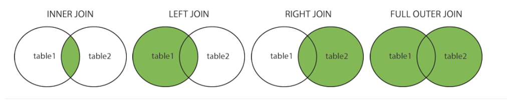

```{r, echo=FALSE, warning=FALSE, message=FALSE, out.width = "50%"}
knitr::include_graphics("images/SQL3.png") 
```

* Image from [listendata.com](https://www.listendata.com/2014/04/proc-sql-select-statement.html){target="_blank"}.

# Main SQL Commands {.tabset .tabset-fade .tabset-pills}


## `SELECT`

The most fundamental SQL skill is to `SELECT` one or more columns. You simply list the columns you need after the `SELECT`, or put an * to select all of the columns. 

1. `SELECT` is well covered in the first chapter of the DataCamp course [Introduction to SQL](https://www.datacamp.com/courses/introduction-to-sql){target="_blank"}. 

2. And the [w3schools SELECT tutorial](https://www.w3schools.com/sql/sql_select.asp){target="_blank"}.

## `FROM`

`FROM` tells SQL which data to query and lets you `JOIN`. There isn't really a training course on how to use `FROM` for one table. Just put the table name after the `FROM` command. When you want to join tables the `FROM` command gets more complex by adding joins. A popular way to explain the different kinds of SQL joins is with Venn diagrams like these from the [w3schools SQL joins Tutorial](https://www.w3schools.com/sql/sql_join.asp){target="_blank"}.

```{r, echo=FALSE, warning=FALSE, message=FALSE, out.width = "100%"}
 
```

<details>
  <summary>Note some people reject the Venn diagram explanation for joins</summary>
    <ul>

Some reccomend you ["Say NO to Venn Diagrams When Explaining Joins"](https://blog.jooq.org/2016/07/05/say-no-to-venn-diagrams-when-explaining-joins/){target="_blank"}. Instead, all joins begin with a `CROSS JOIN` (where every row on the left table is combined with every row on the right table), then all other joins (e.g. `INNER JOIN`) are a filtered version of that `CROSS JOIN`. A cross join is also known as the [Caretsian product](https://en.wikipedia.org/wiki/Cartesian_product) of the two tables.

{width=60%}
* Image from [Essential SQL](https://www.essentialsql.com/cross-join-introduction/){target="_blank}.

Though please note that cross joins are, *"..potentially an expensive and dangerous operation since it can lead to a large data explosion. It is best used in scenarios where a normal join cannot be used and very selective predicates are being used in the WHERE clause to limit the number of produced rows"* [Microsoft Docs](https://docs.microsoft.com/en-us/u-sql/statements-and-expressions/select/from/joins/cross-join). In other words, if you do use a cross join, make sure it is filtered with a `WHERE` clause.

</ul>
</details>

1. Joins are covered in the Oracle Tutorial [Joining Tables](https://livesql.oracle.com/apex/livesql/file/tutorial_G00HFQ7L5MB5BJ2K9612EDNWB.html){target="_blank"}.

2. And chapters 1 and 2 of the Datacamp course [Joining Data in SQL](https://learn.datacamp.com/courses/joining-data-in-postgresql){target="_blank"}. While this course is for the Postrgres flavour of SQL, you will find the methods will work in most flavours (e.g. Oracle or Microsoft SQL Server). 

## `WHERE` (optional)

`WHERE` filters rows.

1. The Oracle tutorial [Querying and Filtering Rows](https://livesql.oracle.com/apex/livesql/file/tutorial_FIYST7OOFBN2ESHA54YUV6WN8.html){target="_blank"} shows you how to use `WHERE` to filter rows.

2. Also, see chapter 2 of the DataCamp course [Introduction to SQL](https://www.datacamp.com/courses/introduction-to-sql){target="_blank"}.

3. And the [w3schools WHERE tutorial](https://www.w3schools.com/sql/sql_where.asp).

## `GROUP BY` (optional)

After you have used `SELECT` to choose the columns you need `FROM` one or more tables, then filtered rows with `WHERE`, a common further *optional* command is to use `GROUP BY`. This will aggregate (e.g.  sum up) values in one or more columns, by the values within another column (or columns). For example, to sum sales values by the values in a date column.  

1. The oracle Tutorial [Aggregating Rows](https://livesql.oracle.com/apex/livesql/file/tutorial_G1UNQOOO9YNU723ZMVP6EGJIO.html){target="_blank"} describes how to both aggregate rows and use `DISTINCT` to find unique values.

2. In DataCamp, use chapter 3 of[Introduction to SQL](https://www.datacamp.com/courses/introduction-to-sql){target="_blank"}.

3. And the [w3schools GROUP BY tutorial](https://www.w3schools.com/sql/sql_groupby.asp){target="_blank"}.

## `HAVING` (optional)

`HAVING` is an *optional* command to filter aggregated data from a `GROUP BY` command. Think of it as a version of `WHERE` created only to filter the result of the `GROUP BY` command.

1. See the [w3schools HAVING tutorial](https://www.w3schools.com/sql/sql_having.asp){target="_blank"}.

## `ORDER BY` (optional)

`ORDER BY` sorts rows by one or more columns. Your data often needs to be sorted so that it is ready to present to a client when exported, for example.

1. Oracle order by methods are covered well in [Sorting and Limiting Rows](https://livesql.oracle.com/apex/livesql/file/tutorial_GMY4RMH9LDCPYKJC615PEOZHT.html){target="_blank"}.

2. See the final chapter 4 of DataCamp's [Introduction to SQL](https://www.datacamp.com/courses/introduction-to-sql){target="_blank"}.

3. And the [w3schools ORDER BY tutorial](https://www.w3schools.com/sql/sql_orderby.asp){target="_blank"}.

# Next most useful SQL commands {.tabset .tabset-fade .tabset-pills}

## `UNION ALL`

Joins in SQL combine columns from two or more tables. However, instead, you want to stack two tables on top of each other where both tables have the same columns. Appending two tables is through `UNION ALL`, while `UNION` will remove any duplicate rows it finds. In other words, joins combine the columns of tables, usually matching on values in one or more columns, while union appends rows with the same columns. 
The image below shows a join:
\  

{width=60%}
<br />
<br />

While this image shows a `UNION ALL`:

<br />
<br />

{width=60%}


* Images from: [essentialsql.com](https://www.essentialsql.com/what-is-the-difference-between-a-join-and-a-union/){target="_blank"}.

1. Try the Oracle tutorial [Union, Minus and Intersect](https://livesql.oracle.com/apex/livesql/file/tutorial_GPSAXIY7KMDX4ALZX654OXY6S.html){target="_blank"}.

2. Chapter 3 of the Datacamp course [Joining Data in SQL](https://learn.datacamp.com/courses/joining-data-in-postgresql){target="_blank"}.

3. And the [w3schools UNION tutorial](https://www.w3schools.com/sql/sql_union.asp){target="_blank"}.

## `CASE WHEN`

`CASE WHEN` is SQL's if-then-else logic for creating new columns. For example, to group the age of people into bands. The method is simple to understand and  de-bug if you lay out your logic in a clear format similar to the [w3schools CASE example](https://www.w3schools.com/sql/sql_ref_case.asp){target="_blank"} below.

```{r}
#https://wch.github.io/webshot/articles/intro.html
library(webshot)
library(magick)
URL <- "https://www.w3schools.com/sql/sql_ref_case.asp"

# Using CSS selectors to pick out regions
webshot::webshot(URL, selector = "#main > div:nth-child(8) > div")
# Did this by using developer tools, select an element to inspect, then copy selector
```

## Handling nulls

Null values can cause problems in every data tool if you don't check for the prresence and handle them appropriately when aggregating. There are specific methods depending on the [type of SQL](https://www.quora.com/Why-are-there-so-many-types-of-SQL-What-is-the-difference-between-all-of-them){target="_blank"} you are using. 

1. Here is the Oracle course on [Querying Null-valued Rows](https://livesql.oracle.com/apex/livesql/file/tutorial_GIEX74ES22UVSEOB0CL100ZL1.html){target="_blank"}.

2. And the [w3schools NULL Functions tutorial](https://www.w3schools.com/sql/sql_isnull.asp){target="_blank"}. 

# Going further with SQL {.tabset .tabset-fade .tabset-pills}

## SQL Formats

Make your SQL code easy to read and de-bug with good foramtting. [How to Properly Format SQL Code](https://dzone.com/articles/24-rules-to-the-sql-formatting-standard){target="_blank"} containes useful tips. Or, if your code does **not** contain sensitive information, use a [SQL formating website](http://www.dpriver.com/pp/sqlformat.htm){target="_blank"}.

## SQL Cheat sheets

Cheat sheets are a good way to quickly remind you of what you have forgotten. There are many online. The [KDnuggets cheatsheet](https://www.kdnuggets.com/2018/07/sql-cheat-sheet.html){target="_blank"} lists SQL commands and methods along with good plain English explanations of what each one does.

## What should I learn next in SQL?

We encourage you to write literate SQL using Common Table Expressions (CTEs). And, if you are an RStudio user, consdier running SQL from RStudio itself. The next two pages in this guide cover [CTEs](https://moj-analytical-services.github.io/SQL_from_square_one/CTEs.html) and using [RStudio with SQL](https://moj-analytical-services.github.io/SQL_from_square_one/RStudio.html).