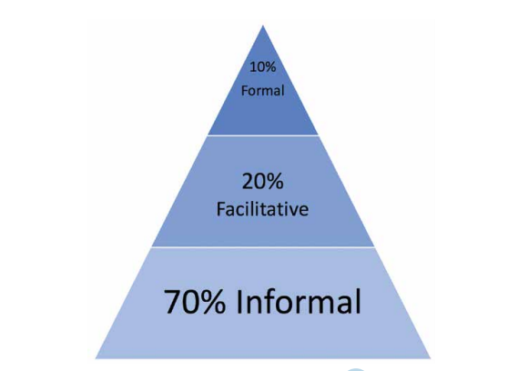
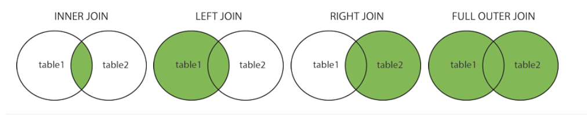

```{r knit_setup, echo = FALSE}
knitr::opts_chunk$set(fig.width = 12,
                      fig.height = 6,
                      fig.align = "left",
                      echo=TRUE, 
                      message=FALSE, 
                      warning=FALSE, 
                      eval= TRUE, 
                      cache = FALSE)
```

```{r, echo=FALSE, warning=FALSE, message=FALSE, out.width = "50%"}
knitr::include_graphics("SQL3.png") 
```
* Image from [listendata.com](https://www.listendata.com/2014/04/proc-sql-select-statement.html){target="_blank"}.

# Background

## Why should I learn SQL?

SQL remains a fundamental data manipulation language in every industry and profession. Because SQL is used everywhere the skill is in [high demand](https://www.dataquest.io/blog/why-sql-is-the-most-important-language-to-learn/){target="_blank"}. While there are alternatives to SQL, the language remains a core tool that can improve the majority of your projects. This includes Data Science, reporting, and most types of data work.

We would like to increase the use and quality of SQL. For example, using SQL more for ad-hoc reporting (instead of Excel for example) or moving heavy data preparation, say from R code to SQL. As well as improving the speed of your work, it will make your more employable with genuine SQL examples on your CV (but don't leave us just yet!). 

## What is this guide for?

This short guide identifies high quality SQL training resources our SQL experts have tested. Below we provide each resource in a logical order. All assume zero knowledge of SQL.

## Learn by doing

However, while this guide points you to good training, we strongly encourage you to learn mostly by **doing** on real data for a real task as soon as you can. The [Analysis Function Career Framework](https://www.gov.uk/government/publications/analysis-function-career-framework){target="_blank"} says that, 

>“Research consistently demonstrates that the most effective learning happens through stretching and challenging assignments and learning on the job. The 70:20:10 model is a philosophy and approach to learning. It consists of: 70% on-the-job learning, 20% of learning through other people and 10% through formal training.” How do we support that mostly on the job learning and through others approach?

```{r, echo=FALSE, warning=FALSE, message=FALSE, out.width = "50%"}
 
```

Or as [David Robinson](http://varianceexplained.org/r/teach-tidyverse/){target="_blank"} says:

>Get students doing powerful things quickly...have goals for what your students should be able to do, and start them doing it as soon as possible.

## Convert a real project to SQL.. **NOW!**

We therefore strongly recommend learning SQL by converting some (or all) of a data task into SQL from whatever tool it was formerly created in (e.g. Excel, R code, Business Objects..). Also, find a SQL mentor to help you do the conversion. Your mentor doesn't have to be a [SQL expert](https://www.quora.com/Do-mentors-have-to-be-experts-in-the-subject-they-provide-mentoring/answer/Michelle-Dixon-10){target="_blank"} themselves to be helpful.

## Your next step - Literate SQL and SQL from RStudio

The key SQL techniques below are the fundamental skills you need. Your next step is to follow and use two more learning resources we have created. These build on the fundamental skills. Both are fully working examples you can run in Oracle.

1. **Literate SQL with Common Table Expressions (CTEs):** Learn how to use Common Table Expressions so that your SQL code is easier to read (much like a story). This is sometimes called [literate SQL](https://modern-sql.com/use-case/literate-sql){target="_blank"}.

2. **Run SQL from RStudio:** Learn how to connect RStudio to Oracle with the new [oracleConnectR R package](https://github.com/moj-analytical-services/oracleConnectR){target="_blank"} and then run SQL from within RStudio using [dbplyr](https://cran.r-project.org/web/packages/dbplyr/vignettes/dbplyr.html){target="_blank"}. This lets you take advantage of the power of the database by move some of your data wrangling from R code to SQL. 

## Online learning - Oracle, DataCamp and w3schools

1. All the Oracle tutorials in the links below open in a single web page. However, they are best viewed by clicking on the green button top right to “Login and Run Tutorial”. To log in you will need to sign up for a **free** Oracle account [here](https://profile.oracle.com/myprofile/account/create-account.jspx){target="_blank"}. The Oracle tutorials were found in the “Code Library” section of [Oracle live SQL](https://livesql.oracle.com/){target="_blank"} with the types filtered to “Tutorial” and the list sorted by “Likes”.

2. Separate chapters of the two DataCamp courses [Introduction to SQL](https://www.datacamp.com/courses/introduction-to-sql){target="_blank"} and [Joining Data in SQL](https://learn.datacamp.com/courses/joining-data-in-postgresql){target="_blank"} are recommended below. DataCamp requires a paid for license you can request from your line manager.

3. The [w3schools SQL tutorials](https://www.w3schools.com/sql/default.asp){target="_blank"} are a great place to get quick help and examples on most of the SQL terms.

# SQL Fundamentals

## `SELECT` columns

The most fundamental SQL skill is how to `SELECT` one or more columns. 

1. `SELECT` is well covered in the first chapter of the DataCamp course [Introduction to SQL](https://www.datacamp.com/courses/introduction-to-sql){target="_blank"}. 

2. And the [w3schools SELECT tutorial](https://www.w3schools.com/sql/sql_select.asp){target="_blank"}.

Broadly, you simply list the columns you need after the `SELECT`, or put an * to select all of the columns. 

## `FROM` tells SQL where the data is and lets you `JOIN` tables

There isn't really a training course on how to use `FROM` for one table. You simply put the table name after the `FROM`. However, when you want to join tables this where your `FROM statement will get more complex. 

A common way to explain the joins you can use in a `FROM` statement is with Venn diagrams like these:

```{r, echo=FALSE, warning=FALSE, message=FALSE, out.width = "100%"}
 
```
* Image from [w3schools SQL Tutorial](https://www.w3schools.com/sql/sql_join.asp){target="_blank"}.

<details>
  <summary>Note that some reject the Venn diagram explanation for joins</summary>
    <ul>

Though some reject the Venn diagram explanation and say [Say NO to Venn Diagrams When Explaining JOINs](https://blog.jooq.org/2016/07/05/say-no-to-venn-diagrams-when-explaining-joins/){target="_blank"}. Instead they explain that all joins begin with a `CROSS JOIN` (where every row on the left table is combined with every row on the right table), then all other joins (e.g. `INNER JOIN`) are a filtered version of that `CROSS JOIN`. 

{width=60%}
* Image from [Essential SQL](https://www.essentialsql.com/cross-join-introduction/){target="_blank}.

Though please note that cross joins themselves are, *"..potentially an expensive and dangerous operation since it can lead to a large data explosion. It is best used in scenarios where a normal join cannot be used and very selective predicates are being used in the WHERE clause to limit the number of produced rows"* [Microsoft Docs](https://docs.microsoft.com/en-us/u-sql/statements-and-expressions/select/from/joins/cross-join). In other words, if you do use a cross join, make sure it is filtered with a `WHERE` clause.

</ul>
</details>

1. Joins are covered in this Oracle Tutorial [Joining Tables](https://livesql.oracle.com/apex/livesql/file/tutorial_G00HFQ7L5MB5BJ2K9612EDNWB.html){target="_blank"}.

2. And chapters 1 and 2 of the Datacamp course [Joining Data in SQL](https://learn.datacamp.com/courses/joining-data-in-postgresql){target="_blank"}. While this course is for the Postrgres flavour of SQL, you will find the methods will work in most flavours (e.g. Oracle or Microsoft SQL Server). 

## `WHERE` will filter rows

1. The Oracle tutorial [Querying and Filtering Rows](https://livesql.oracle.com/apex/livesql/file/tutorial_FIYST7OOFBN2ESHA54YUV6WN8.html){target="_blank"} shows you how to use`WHERE` to filter rows.

2. Also, see chapter 2 of the DataCamp course [Introduction to SQL](https://www.datacamp.com/courses/introduction-to-sql){target="_blank"}.

3. And the [w3schools WHERE tutorial](https://www.w3schools.com/sql/sql_where.asp).

## `GROUP BY` will aggregate rows by the values in one or more other columns

After you have used `SELECT` to choose the columns you need `FROM` one or more tables, then filtered rows with `WHERE`, a common further step is to use `GROUP BY` to aggregate (or sum up) values in one or more columns by the values within another column (or columns). For example, to aggregate your data by a date column.  

1. The oracle Tutorial [Aggregating Rows](https://livesql.oracle.com/apex/livesql/file/tutorial_G1UNQOOO9YNU723ZMVP6EGJIO.html){target="_blank"} describes how to both aggregate rows and use `DISTINCT` to find unique values.

2. In DataCamp use chapter 3 of DataCamp's [Introduction to SQL](https://www.datacamp.com/courses/introduction-to-sql){target="_blank"}.

3. And the [w3schools GROUP BY tutorial](https://www.w3schools.com/sql/sql_groupby.asp){target="_blank"}.

## `HAVING` filters the aggregated data from the `GROUP BY`

`HAVING` is how you filter rows that have been aggregated with a `GROUP BY`. You can think of it as a version of `WHERE` created only to filter the results of a `GROUP BY`.

1. See the [w3schools HAVING tutorial](https://www.w3schools.com/sql/sql_having.asp){target="_blank"}.

## `ORDER BY` will order or sort rows by one or more columns

Your data often needs to be sorted in a logical order using `ORDER BY` so that it is ready to present to a client when exported, for example.

1. Oracle methods that are common to most SQL flavours to sort rows are covered well in [Sorting and Limiting Rows](https://livesql.oracle.com/apex/livesql/file/tutorial_GMY4RMH9LDCPYKJC615PEOZHT.html){target="_blank"}.

2. And the final chapter 4 of DataCamp's [Introduction to SQL](https://www.datacamp.com/courses/introduction-to-sql){target="_blank"}.

3. And the [w3schools ORDER BY tutorial](https://www.w3schools.com/sql/sql_orderby.asp){target="_blank"}.

## `UNION` and `UNION ALL`

Joins in SQL combine columns from two or more tables. However, you may simply want to stack two tables on top of each other where the columns are the same. This is where 'UNION ALL' is required. In contrast, `UNION` will remove any duplicate rows it finds. In other words, joins combine tables in columns, and union combines rows with the same columns. 

The image below shows a join:
\  

{width=60%}
<br />
<br />

While this image shows a `UNION`:

<br />
<br />

{width=60%}


* Images from: [essentialsql.com](https://www.essentialsql.com/what-is-the-difference-between-a-join-and-a-union/){target="_blank"}.

1. Please try the Oracle tutorial [Union, Minus and Intersect](https://livesql.oracle.com/apex/livesql/file/tutorial_GPSAXIY7KMDX4ALZX654OXY6S.html){target="_blank"}.

2. And chapter 3 of the Datacamp course [Joining Data in SQL](https://learn.datacamp.com/courses/joining-data-in-postgresql){target="_blank"}.

3. And the [w3schools UNION tutorial](https://www.w3schools.com/sql/sql_union.asp){target="_blank"}.

## Handling nulls

Null values are a challenge in every data tool. There are specific methods depending on the flavour of SQL you are using. 

1. Here is the Oracle course on [Querying Null-valued Rows](https://livesql.oracle.com/apex/livesql/file/tutorial_GIEX74ES22UVSEOB0CL100ZL1.html){target="_blank"}.

2. And the [w3schools NULL Functions tutorial](https://www.w3schools.com/sql/sql_isnull.asp){target="_blank"}. 

# Cheat sheets

Once you are familiar with these key skills and have used them a few times, cheat sheets are a good way to quickly remind you of what you have forgotten. There are many SQL cheat sheets online, but this [KDnuggets cheatsheet](https://www.kdnuggets.com/2018/07/sql-cheat-sheet.html){target="_blank"} combines the SQL code you need with a clear plain English explanation.
