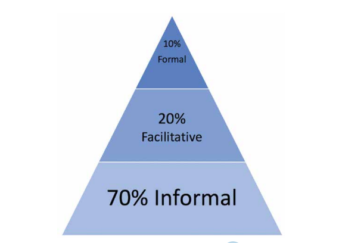

<br />
<br />


# Why should I learn SQL?

SQL is a key fundamental data manipulation language in every industry and profession. Because SQL is used everywhere the skill is in [high demand](https://www.dataquest.io/blog/why-sql-is-the-most-important-language-to-learn/){target="_blank"}. While there are alternatives to SQL, the language remains a core tool that can improve the majority of your projects. This includes data science, reporting, and data engineering.

We would like to increase the use and quality of SQL. For example, using SQL more for ad-hoc reporting (instead of Excel for example) or moving heavy data preparation, say from R code to SQL. As well making your your data preperation faster, SQL will make you more employable if you have genuine SQL examples to describe at interview (but don't leave us just yet!). 

# What is this guide for?

This short guide points you to high quality online SQL training resources our SQL experts have tested. All of them assume zero knowledge of SQL and are suitable to those of you starting from square one.

# Learn by doing...**NOW!**

The [Analysis Function Career Framework](https://www.gov.uk/government/publications/analysis-function-career-framework){target="_blank"} says that, 

>“Research consistently demonstrates that the most effective learning happens through stretching and challenging assignments and learning on the job. The 70:20:10 model is a philosophy and approach to learning. It consists of: 70% on-the-job learning, 20% of learning through other people and 10% through formal training.” How do we support that mostly on the job learning and through others approach?

```{r, echo=FALSE, warning=FALSE, message=FALSE, out.width = "50%"}
 
```

Or as [David Robinson](http://varianceexplained.org/r/teach-tidyverse/){target="_blank"} says:

>Get students doing powerful things quickly...have goals for what your students should be able to do, and start them doing it as soon as possible.

So we strongly encourage you to learn SQL mostly by **doing**. Use real data for a real task as soon as you can. 
Convert some (or all) of a data task into SQL from whatever tool it was formerly created in (e.g. Excel, R code, Business Objects..). Find a SQL mentor to help you do the conversion. Your mentor doesn't have to be a [SQL expert](https://www.quora.com/Do-mentors-have-to-be-experts-in-the-subject-they-provide-mentoring/answer/Michelle-Dixon-10){target="_blank"} to be helpful.

# Reccomended online learning

1. All the Oracle tutorials linked in this guide open in a single web page. The SQL can be run after clicking on the green button top right to *“Login and Run Tutorial”*. To log in you will need to sign up for a **free** Oracle account [here](https://profile.oracle.com/myprofile/account/create-account.jspx){target="_blank"}. The Oracle tutorials were found in the “Code Library” section of [Oracle live SQL](https://livesql.oracle.com/){target="_blank"} with the types filtered to “Tutorial” and the list sorted by “Likes”.

2. We reccomend Separate chapters from two DataCamp SQL courses: [Introduction to SQL](https://www.datacamp.com/courses/introduction-to-sql){target="_blank"} and [Joining Data in SQL](https://learn.datacamp.com/courses/joining-data-in-postgresql){target="_blank"}. You will need a paid license you can request from your line manager.

3. The [w3schools SQL tutorials](https://www.w3schools.com/sql/default.asp){target="_blank"} are a great place to get quick help and examples on most of the SQL terms.